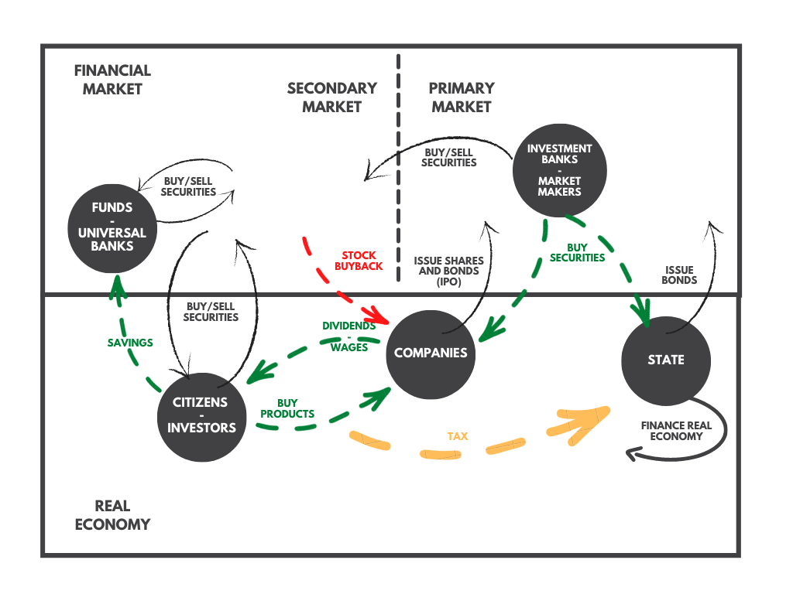
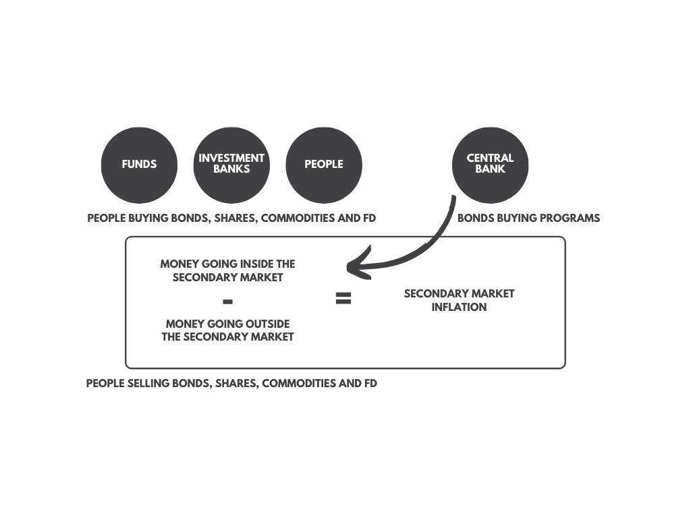
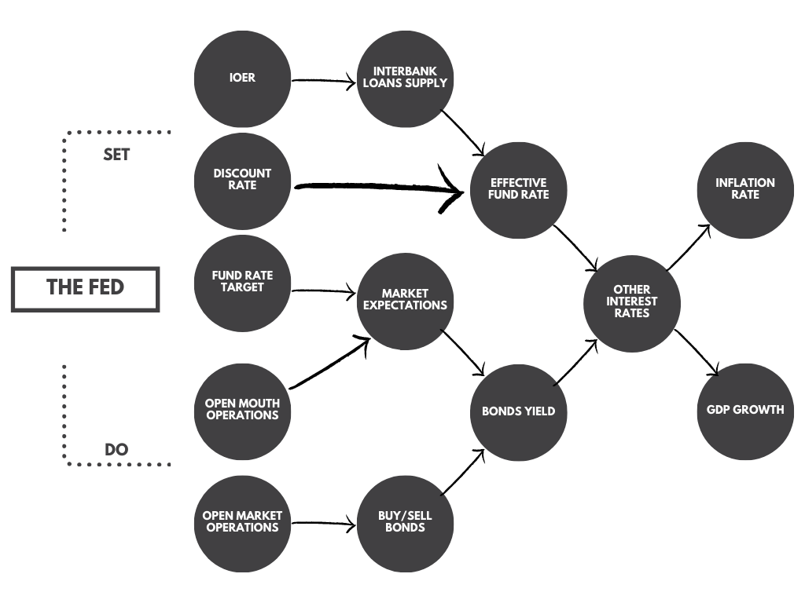
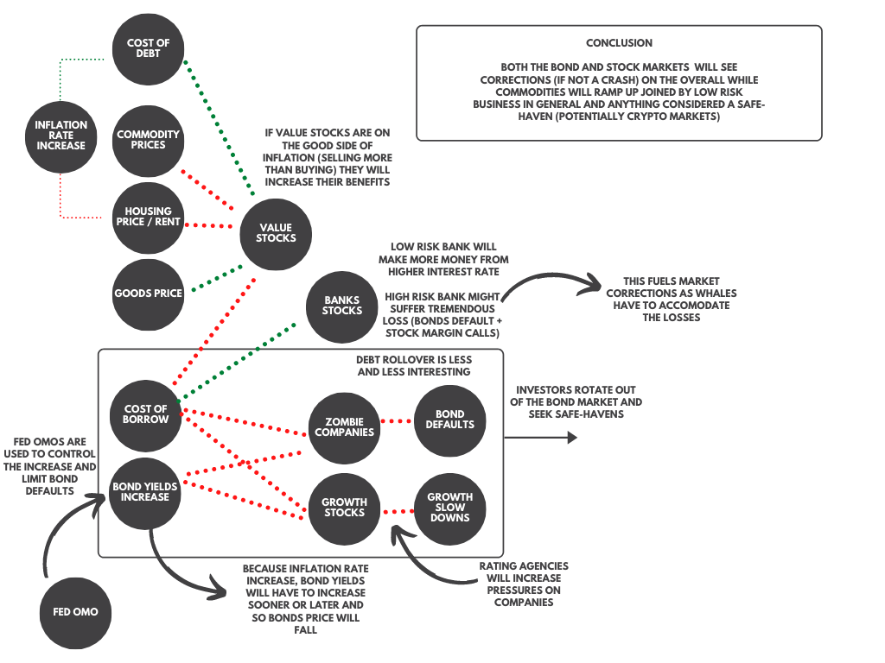

## Inflation and market dynamics: A primer
Meh!

I've been lurking in the [Reddit r/options](https://www.reddit.com/r/options/) lately and I stumbled upon this [post](https://www.reddit.com/r/options/comments/m4ffmx/long_commodities_short_bonds_protection_against/) predicting doomsday, hyperinflation, the crash of the bond market and subsequently, the stock market.

I don't know if those hypotheses hold or not. But I saw an opportunity to fill some holes in my knowledge about what would trigger this doomsday crash. So, I decided to explore the subject and write a quick primer about this inflation thing and why it matters.

It is in no way state-of-the-art thinking nor perfectly accurate. The devil always hides in the details and this is not the aim of this post. On top of that, it took me quite a while to do the research, learn and finally write this piece. If it feels like you would have rather read it a month ago, I feel you, my friend, I do too...

Anyway, remember to do your own DD, apply what you learn, make your prediction, observe what happens, learn from your mistakes and repeat!

> Obviously, this is not financial advice and only some educational material.

## TL;DR
Expected inflation and inflation will rise but should be transient (Mainly because of the surge in demand when the economy reopens). This means that we are going to be in a transient dynamic at least until the end of the year. Bonds yield will probably increase which might create a small bond market crash (hopefully in a controlled manner), a massive amount of investment will rotate in other assets like stocks and crypto for a while.
In the short term, any company selling goods, loans or having strong fundamentals should see a good run, on the other hand, risky ones functioning on high-interest debts will have to survive in those troubled times. 
After a while, inflation will get back to its 2% target, and the economy should boom again. 
The remaining question is: What will be the size of the correction? The risk is quite high because of how fast the margin debt is increasing and how high volatility remains. It hints that some assets in financial markets currently hyperinflated (bubbles) and we are in an overall casino market.

To conclude,  it's not the time to YOLO as the market will probably see corrections here and there and so, having a diversified portfolio and an eye on all financial markets, Government and FED news is necessary to be able to react rapidly. It looks like it is the best possible behaviours in the coming month.

To do so, you can look at this [hyperinflation dashboard](../hyperinflation)

## A quick overview of the game
Before diving into what is inflation and how it impacts investors, let's look at the game itself.

We are playing the investment game. In this game, you have investors on one side and assets on the other. Investors try to make money by investing in those assets and assets try to attract investors money so they can grow.

This game is played all around the world, 24h/7: it's a global economic competition and collaboration system.

### investors
When you make a profit in your life, you have only three possibilities: Either you keep it safe somewhere, you spend it to consume something or you invest it.

If you invest it, you are an investor and the investor plan is very simple:

- Invest money in assets
- Wait
- Profit (gets back more money)

The difficult part is in "picking the right assets". Investors have a nearly infinite amount of possible investments in this world: Housing, startup, stock, bonds, derivatives, art, crypto, NFTs, etc. you name it. And, access to all those investments has never been so easy.

So, anyone can be an investor. All we need is the will to follow the simple plan. The good news is that we can adapt any part of it to fit one's requirements:

- The amount of the investment: from $0.01 to $1 Trillion.
- The amount of time one wishes to/must let money in the asset: from 1 millisecond to a century.
- The amount of risk one wish/must take: from risk-free assets to lottery ones.

To track its success along the game, the investor can easily measure (as a gross estimate) his return on investment (ROI) like this:

$$ \text{ROI} = \frac{\text{Final value of the investment} - \text{Cost of the investment}}{\text{Cost of the investment}} $$

His goal will then to maximise it. But maximising is not a well-defined goal in itself, every investor has to deal with constraints. This is why it is good to consider that maximisation through those 3 sub-goals:

- How much one wants to make?
- How long is one ready to wait?
- How much risk one is ready to take?

#### Multiple kinds of investors
Depending on those previous requirements and goals, investors exist in every kind. (I won't go into details but you might want to look at how any of those behave in details). They can be separated into 2 big kinds:

- The one investing in assets.
- The one trying to provide assets in enough quantity to facilitate trades. (You can consider them as big resellers, they are not trying to make money on capital gain but much more by taking a little part of every trades).
 
Among those investing, we have:

- Pension funds: invest a lot, wait a lot, lower risk to the maximum. Needs to rebalance portfolio regularly to minimize the risk (Beware of end of quarters!)
- Other Funds (mutual, ETF, family office, etc.): invest a lot, wait moderately. Depending on their style they might be very risky or not. You must do your work per fund to understands their behaviours
- Retail traders: you, me, everyone trading from home. Invest very little compared to other actors but are present in a much bigger number. So much now, that it starts to make a difference (thanks to how fast information propagate).

Among those trying to facilitate trades:

- High-frequency traders and market makers: Invest tiny amounts, very very fast, low risk. They are making money by helping the market do its job more than by betting inside of it.

What you want to look for with those different investors is their generic strategy and to which requirements they are bound by law/contracts. For example, pension funds have to keep a certain level of allocation of risks between bonds and stocks with only minor adjustment along the way. Indeed, if we play with our own money, we are the only ones responsible for a loss, but organisation taking other people money for investing ensure to their customer that they manage their risks properly, or at least in such a way that their customer is aware of it.

One last concept that investors tend to follow is "investment rotation". As the name suggests, it is when investors "rotate" some investment from one asset to some others. It tends to create a temporary trend in the market (along a few days to a few weeks). There are many reasons for that ([window dressing](https://www.investopedia.com/terms/w/windowdressing.asp), [portfolio rebalancing](https://www.investopedia.com/terms/r/rebalancing.asp), [sector rotation](https://www.investopedia.com/articles/trading/05/020305.asp), etc.) for example. 

### Assets
On the other side, assets try to attract investors money. This is a prolific area with a lot of creativity, new kind of assets are created all the time: the need to satisfy any kind of investors spurs into reality any kind of assets: secure, risky, volatile, constant, expensive, cheap, complex, etc. 

The way they attract investors is by making a promise. Mainly, a promise of a juicy ROI and/or low risk. Some assets are backed with strong fundamentals and financial mechanics like bonds, others are just pure promises, no ties attached (like SPACs).

Their prices in the financial markets are driven by multiple forces among which is supply and demand. And supply/demand needs a place to express itself.

## Financial markets
Financial markets exist because on one hand, companies and states need a way to finance their work and on the other hand, people needs a way to invest their money.

The goal of financial markets is to make that happen and they are divided into two parts to do so:

- The primary market where securities (stocks, bonds) are issued (created): state/company trade with investors.
- The secondary market (a second-hand market) where existing securities can be traded again and again: investors trade with investors

The first one allows companies and states to raise money, the second one allows investors to change their mind at any time.

On those markets, you find 4 kinds of products: stocks, bonds, financial derivatives and commodities. They all represent a standardized and regulated way to facilitate the above 2 goals.

### Stocks
When you invest in stocks, you buy shares. Shares represent a piece of a company, when you buy one, it means you own a part of the company. The overall value of the company called the market capitalization is represented by the sum of all those shares price.
$$\text{Company valuation} = \text{Market Capitalization} = \text{Number of shares} * \text{Value of a share}$$

Buying them allows one to receive dividends (a redistribution of a part of the profit to shareholders) and to vote on some of the company strategic decision (like the proportion of dividends for example).

The price of those share on the secondary market is mainly set by supply and demands. Investors decide to invest based on three criteria:

- The financial value of the company
- The debt of the company
- The potential of the company (this is where speculation happens).

The expectation in the company's performance is a key force that usually creates heated debates. Fame is also a factor: the more the company is attractive the more its share price increase. 

*Sidenote: sometimes you hear about fundamental analysis to set the valuation of the company. From my point of view, this just gives us a lower bound: the measurable value of the company now. But it leaves out expectations, fame and everything else impacted by human emotions!*

> What signal?
>
> - [Vanguard Total Stock Market ETF](https://finance.yahoo.com/quote/VTI)

#### Growth stocks, value stocks and other kinds of stocks
Individual investors tend to end up in two categories: value or growth investors (not yet talking about gamblers). To keep it simple, one bets on what we call "growth stocks" which have high potential but needs a lot of investment and loans (with bonds) to realize it. The other one bets on so-called "value stocks" which are the opposite: undervalued profitable companies.

Both have a high potential, the first one is expected to grow very much and so its share price too. The other one is considered undervalued and so should go through a positive correction of its share price in the future. For examples, Tesla is a growth stock and GME was a value stock (Although it might be a growth stock now!).

Outside of those two shiny categories, you have many other kinds of stocks in every industry: penny stocks (share price under 1$), zombie companies (companies that aren’t earning enough to cover their interest expenses), etc. All of them contains different risks and attract a different kind of investors.

> Do the work:
>
> - [Value and growth stocks](https://www.merrilledge.com/article/growth-vs-value-investing-two-approaches-to-stocks)
> - [Inflation impact on value and growth stocks](https://www.investopedia.com/articles/investing/052913/inflations-impact-stock-returns.asp)

> What signal?
>
> - [Nasdaq 100 index, 100 of the largest non-financial companies listed on the Nasdaq exchange](https://finance.yahoo.com/quote/%5ENDX?p=^NDX&.tsrc=fin-srch)
> - [S&P 500, 500 large capitalization companies](https://finance.yahoo.com/quote/%5EGSPC?p=^GSPC&.tsrc=fin-srch)
> - [Russel 2000, 2000 small capitalization companies](https://finance.yahoo.com/quote/%5ERUT?p=^RUT&.tsrc=fin-srch)
> - [A value ETF (Vanguard)](https://finance.yahoo.com/quote/VTV?p=VTV&.tsrc=fin-srch)
> - [A growth ETF (Vanguard)](https://finance.yahoo.com/quote/VUG?p=VUG&.tsrc=fin-srch)q

### Bonds
Bonds are very different as they represent a piece of a bigger loan contract. A bond is one piece of the loan. This allows many investors to lend money to one company/state.

As a contract, it is issued with more properties than stocks (which can be represented by just one number, the price):

- The face value: the original price at which the bond is issued
- The coupon rate (interest rate): Annual percentage of the face value paid to the bondholder. Can be fixed or variable.
- Maturity date: the date at which the amount of borrowed money (Called "the principal" = the face value) is given back to the bondholder.
- The total number of bonds

Bonds are interesting because they lower the risk of losing money as long as the probability of being reimbursed is high. Let's say one buys some bonds on the primary market:

- One pays the face value of the bonds to acquire them.
- One then receives a fixed income equal to the coupon annual payment every year.
- One gets back the principal at the maturity date.

As you can see, as long as you expect the borrower to be able to reimburse you, you are sure to make money in the meantime. This is also why they are called "fix income" securities.

#### What happens on the secondary market?
After bonds are issued, their price is subject to the usual market forces. Their current price is not fixed and can fluctuate: this is also why the face value is called "face value" and not just "the price". This is also why it is written on the bond: if you want to buy a bond on the secondary market, you must know the face value to know how much you'll get back at maturity.

Now, because all the properties of the bonds are fixed (face value, coupon's rate, maturity date and quantity) and its price remains dynamic, it introduces a new notion: the yield.

The bond yield can be seen as its dynamic interest rate and is calculated relatively to its current price:

$$ \text{bond yield} = \frac{\text{annual coupon payment}}{\text{current bond price}}$$

*Sidenote: Note that by definition, the yield is inversely linked to the bond price: if the yield increase, the bond price decrease and vice-versa.*

As a quick example, a bond with a face value of $\text{\$1000}$ with a fixed coupon's rate of 5% per year leads to a total coupon annual payment of $\text{\$50}$. if the price of the bonds decrease to $\text{\$900}$ the yield is now $\frac{50}{900} = 0.55 = 5.5\%$ which is higher than the original coupon's rate and makes the bond more interesting. 

Not only one would buy that bond at a lower price, but one would also receive a higher annual interest rate relative to its investment. Also, if one would keep it until the maturity date, one would still receive the full face value (which is still $1000 and which increase even more what is called the yield at maturity).

Bonds yields are a good measure for investors because you can compare them directly to the inflation rate or your expected inflation rate for the period you want to hold onto it. This means that the current inflation rate has a direct impact on bonds yield: Outside of any external intervention, supply and demands on bonds should move their price such that their yield satisfy the following:

$$ \text{yield} > \text{inflation rate} \Rightarrow \text{current price} < \frac{\text{coupon's value}}{\text{inflation rate}}$$

So far so good. So what is the catch? First, bonds don't provide a high expected ROI so one might not be interested to trade bonds. Second, they still suffer from 2 kinds of risk.

#### How to perceive bonds risk?
The first risk is inflation. Since bonds are quite a long term investment because of the low yield they provide, they are quite susceptible to expected inflation. As we've seen bonds yield will have to go up if inflation goes up because investors won't hold on to bonds that make them lose some purchasing powers.

This means that if you buy a bond and you plan to sell it, you better hope that the inflation rate will not increase. Because first, your real ROI will be lower and second, you will have to sell your bonds at a lower price (remember, when bond yield increase, bond price decrease). So investors spend some times trying to predict inflation to make sure they are not buying bonds at too high prices (or too low yield).

This is why a stabilized inflation rate is not dangerous to the open market. If it does not move, it does not provide a risk for bonds yield and so investors are confident.

This inflation risk is especially important for long-term bonds (>3 years until maturity date). Now for bonds that have their maturity date much closer, there is another risk: the default risk. The borrower might not be able to return the principals on the maturity date. We say that the bond default.

It's rare to see a bond default before the maturity date because the coupon's annual payment should not be very high for the borrower. At maturity, on the other hand, the total principal is huge. And if the borrower does not have the money or is struggling to issue new bonds, it might be in trouble to reimburse the full amount.

When the economy is all right and the company legit, the borrower will just roll over its debt to avoid defaulting its bonds. It just means issuing new bonds to be able to pay back previous bonds and keeps going. The risk is then pushed on new bondholders. 

All of this ask one question: how do you know that a company is legit?

#### Rating agencies
This is when rating agencies come into the picture. Their goal is to rate bonds on their default risk. The rating agencies look at companies fundamentals and conclude on a grade. There is quite a lot of different grades and those grades are different between agencies but ultimately, those grades are separated into two categories: "investment grade" or "junk bonds" (also called "high-yield bonds").

The distinction has a big impact on bonds price because naturally, investors will want a higher yield for a higher risk. If a company starts to struggle financially, its bond might be downgraded by rating agencies and the grade can fall under the junk bonds umbrella. The bond market will react by asking for a higher yield and so, the bond price of that company will fall rapidly.

This starts a domino effect for the company: issuing new bonds will need a higher coupon's rate which increases the cost of borrowing for the company and so increases the risk of default of its existing bonds. 

This is especially bad for companies called "zombies company" which are the ones struggling to survive, they make barely enough (or not enough) money to sustain their operation and pays its interest. And their outlook is not great (it is the main difference with growth companies, usually running on debts too, but with a high expected success).

Those zombie companies are in real trouble if rates increase and so are very risky.

*Sidenote: One thing very shady with those agencies is that to get a grade you must pay them. It sounds like if you pay them a lot you might have a better grade, but what the f\*\*\* do I know?*

> Do the work:
>
> - [https://www.investopedia.com/terms/b/bond.asp](https://www.investopedia.com/terms/b/bond.asp)
> - [https://www.investopedia.com/ask/answers/061715/how-bond-yield-affected-monetary-policy.asp](https://www.investopedia.com/ask/answers/061715/how-bond-yield-affected-monetary-policy.asp)
> - [https://www.thestreet.com/investing/frequently-asked-questions-about-the-bond-market-1087488](https://www.thestreet.com/investing/frequently-asked-questions-about-the-bond-market-1087488)
> - [https://www.investopedia.com/ask/answers/09/difference-between-yields-and-interest-rate.asp](https://www.investopedia.com/ask/answers/09/difference-between-yields-and-interest-rate.asp)

> What signal?
>
> - [Vanguard Total US Bond Market ETF](https://finance.yahoo.com/quote/BND)
> - [Vanguard Total world (investment-grade) Bond Market ETF ](https://finance.yahoo.com/quote/BNDX)

### Financial derivatives (FD)
I'm not going to talk about them but you consider them as a bet. Any potential events in the financial market can be transformed into a contract. When you buy or sell one, you either bet for or against that event. 

Just as a quick example: a call option is a bet that the price of a company's share will increase and reach a price level before or at a precise date.

### The markets graph

## So, what is inflation?
Inflation (and deflation) are words that refer to the rate of change in the price of "things". Understand "things" very broadly here: food, energy, house, stocks, bonds, ETF, etc. Anything that has a price.

To get the inflation rate of a thing:

- One look at the current price of it at a time $t$: $p_t$.
- One wait some time: $\Delta t$.
- One look again at those same prices: $p_{t + \Delta t}$.
- Finally, one calculates the ratio as follow:

$$\text{inflation rate} = R_i = \frac{p_{t + \Delta t} - p_t}{p_t}$$

- If $R_i \lt 0\%$, we use the term deflation.
- If $R_i \gt 0\%$ we use the term inflation.
- If $R_i \gt 50\%$ we use the term hyperinflation.

Nothing more, nothing less.

*Sidenote: notice how it is similar to the investor simple plan and the ROI formula*

The inflation rate can be measured for anything and people indeed measure the inflation of everything. Having a good way to measure inflation correctly is still a subject of hefty debate because it depends on how one lives. But they are a few measures considered as good proxies. 

The first one is the [Consumer price index (CPI) ](https://en.wikipedia.org/wiki/Consumer_price_index). People tend to focus on it because it is supposed to represent the cost of living for the urban lower and middle class. It contains a basket of goods one has to pay for when living in cities. If you live outside of cities, you want to look at one of its variants like the [Personal Consumption expenditures price index (PCEPI)](https://en.wikipedia.org/wiki/Personal_consumption_expenditures_price_index)

*Sidenote: The CPI is an average of different prices which should represent the average expenditure for an urban family. It does not contain inflation for housing or the open market. Because of that people are wary that it is not a very good signal for actual inflation. On top of that, it is usually considered a lagging signal in the sense that it is a measure of the past and not the present.*

Another interesting variation is the [core inflation rate](https://fred.stlouisfed.org/series/CPILFESL). It is the CPI (or the PCEPI) without food and energy which varies a lot (too volatile). For that reason, it is better to detect trends.

The CPI is only useful from the point of view of a consumer. This is why there exists another one for the point of view of producer: the [Producer Price Index(PPI)](https://en.wikipedia.org/wiki/Producer_price_index).

> Do the work:
>
> - [Official source for the CPI](https://www.bls.gov/cpi)
> - [Core inflation rate](https://www.thebalance.com/core-inflation-rate-3305918)

> What signal?
>
> - [US CPI](https://fred.stlouisfed.org/series/FPCPITOTLZGUSA)
> - [US PCEPI](https://fred.stlouisfed.org/series/PCE)

### Why should I care?
Inflation impacts directly investors because it lowers the value of money which impact what we call the "purchasing power".

The purchasing power is the power to buy things: If $100 this year allows you to buy fewer things than $100 5 years ago, then you lost some purchasing power. It matters directly to everyone because it is the link between money and reality. And since the inflation rate measure how prices change, it becomes the direct measure of how much anyone (including investors) need to grow their amount of money to keep their purchasing power:

$$ \text{ROI} > \text{inflation rate} $$

This is why people tend to take inflation directly into account when computing returns or other measures. When doing so, people add the word "real" before the measure. For example, the "ROI" become the "real ROI" and can be calculated as:

$$ \text{real ROI} = \text{ROI} - \text{inflation rate}$$

*Sidenote: The actual investors objective is even higher as one must take into account many other costs like taxes and the cost of living during the investment period*

### Why the price of things changes?
Before going any further, it is really important to understand that **nobody** understands what creates inflation. We have yet to find a strong causal relationship for it, mainly because they are so many factors that impact something's price.

On one side we have what goes into the cost of things:

- Cost of borrowing: all the price one has to pay to borrow money (interest rates). It is usually needed for an investment to start producing anything (or scaling its production).
- Cost of production: all the cost one must pay to make the thing real: labour wages, raw materials cost, etc.
- Cost of distribution: all the cost one must pay to bring the product to the people and make the people aware of it: delivery cost, marketing, communication, etc.
- Other costs like insurance etc.

On the other side we have what goes into the demand of things:

- People confidence in the future (no needs to save money, let's spend!)
- Money distribution: how wealth is distributed

Both of those generate the queen forces of supply and demand: how much people want that thing compared to how many ones of that thing be produced.

Finally, external factors can drastically impact them too:

- Environmental crisis: climate change, drought, etc.
- Political instability: war, revolution, treaties, embargo, etc.
- Random events ([like the evergreen boat stuck in the Suez Canal](https://www.bbc.com/news/business-56559073))

Price changes because one of those factors is impacted. Tax cuts or hikes can raise or lowers the cost of production and distribution. Risk can increase which increase insurance cost, etc.

For supply and demands, it is even more complex as an increase/decrease in demand is not necessarily met by a price increase/decrease as it could be met by an increase/decrease of supply instead: Producers can adapt to the market. Price will move only if the change is sudden: high demand increase would lead to what we call a demand-pool effect, increasing prices and a sudden drop of supply would lead to the same outcome (called a cost-push).

*Sidenote: I'm not even talking about how humans can be creative just like with luxury products where their rarity is artificially maintained by luxury brands.*

All things being equal, I want to highlight the fact that increasing the money supply is **not** a cause of inflation (sorry Milton). This belief has been debunked by past experiments many times. At most, increasing the money supply can impact inflation in the long term but never in short term. Inflation is much more linked to the other factors.

> Do the work:
>
> - [Inflation theories](https://www.britannica.com/topic/inflation-economics)

#### The special case of the exchange rate
As long as a country is making business with the outside world, the exchange rate impacts all its exportation and importation. So it impacts the cost of productions and distributions.

What makes that rate change? Hard to know as it is controlled by a very speculative financial market called the foreign exchange. The only thing I could venture to say is that its trend should be impacted by the relative confidence between currencies.

If people see the dollars as a good store of value, they will prefer to be paid in dollars when they sell something. This makes the dollar overall attractive and we should see the foreign exchange value the dollar more relative to other currencies.

Now, why people would rather be paid in dollars? Because you expect that precise currency to keep its value through time. Why would you believe in that? Probably because the United States of America is the top one country in the world when we look at the GDP per Capita (per people) and this is how we measure happiness in our current belief system.

> What signal?:
>
> - [GDP leaderboard](https://www.worldometers.info/gdp/gdp-by-country)

### Different kind of inflation
We tend to distinguish 5 regime of inflation:

- Hyper-deflation (IR < -50%)
- Deflation (IR < 0%)
- Inflation (IR ~= 2%)
- High inflation (5% < IR < 50%)
- Hyperinflation ( IR > 50%)

Inflation is good as long as it is moderate and even more importantly stable. In this case, it gives time to the real economy to adapt its price, wages and production. Problems arise when it fluctuates a lot creating a lot of anxiety about price or when it's too high or too low. 

Deflation is the worst as it creates a self-reinforcing loop pushing a country into more and more misery. And the second worse is hyperinflation where no one in the economy has time to adapt creating a lot of instability.

*Sidenote: Near-zero inflation is also considered harmful because it is believed that they are signs of a worsening economy, deflation might be on our doorstep).*

This is why people have decided that 2% of inflation is good. It gives us a safeguard against deflation, allows the economy to adapt and boost spending. But as always in the economy, there is no proof that this is true, it is completely arbitrary and is motivated more by past observations than any scientific demonstration.

> Do the work:
>
> - [https://en.wikipedia.org/wiki/Inflation](https://en.wikipedia.org/wiki/Inflation)
> - [https://www.investopedia.com/terms/h/hyperinflation.asp](https://www.investopedia.com/terms/h/hyperinflation.asp)

### When does inflation transform into hyperinflation?
It does not unless we have some very special and very rare economical conditions, it is always the result of an already very weak economy poorly managed by politics.

Hyperinflation is a sudden and strong inflation rate increase (usually when percentage does not hold any meaning anymore). If we were to experience hyperinflation on the CPI, it would mean that in a few weeks, the price of everything, including the baguette could surge: With a 50% rate month-to-month hyperinflation, a baguette that cost $1 today could cost $1.5 next month!

*sidenote: because there is no official threshold on the inflation rate to declare hyperinflation (there is only a conventional one at 50% per month). it is the kind of concept that the media loves to nourish their fear-mongering business (which will probably increase expected inflation).  I would expect that a 10% inflation rate will be enough to see the word hyperinflation screamed everywhere, even though that would just be a high inflation rate.*

In history we have mainly 3 cases:

- The German case happened after their defeat in world war 1. They were under drastic limitation from the international community, we could even say they were suffering a kind of punishment from the world.
- The current Venezuela case. A perfect Achilles heel example of an economy supported by only one resource (oil). No surprise that a production problem or a lower price of that resource would start a downward spiral for the whole country.

For example, Germany saw a hyperinflation period after the first world war because they had to reimburse all the war winners and were forbidden to use some of their financial tools to boost their economy. Currently, Venezuela suffers hyperinflation because their whole economy was relying on petrol exportation to be able to import everything else. When the price of petrol fell, everything started to run out which started hyperinflation (see below for more information).

To conclude, this will not happen in a normally diversified economy not suffering a catastrophic event like a war or a huge natural catastrophe (Climate change is a good candidate in the long-term). What is much more probable is a high inflation rate for some time. 

### Impact on the real economy
- Your savings value diminish: Since inflation raise prices, the same amount of money can buy fewer and fewer goods the more time passes. So inflation is not good for savers.
- Your debt value diminish too: Again, since the same amount of money can buy less and less, it is expected to earn more in the future than now. It should then ease your capacity to reimburse your debt the more time passes. So inflation is good for existing borrowers.
- The effect on the debt, make lender mush less happy: because they are on the other side of the credit, they have to make sure that the inflation rate does not increase so much that it overcomes their interest rate. If it does, they will start to increase their interest rate and reduce the quantity of credit. So inflation is bad for lenders and new borrowers
- Money redistribution: Companies tend to transfer inflation on their cost to the end customer making more money in the process. But they tend to avoid raising wages too. This extra money is usually redistributed to the shareholders. Overall inflation tends to increase inequalities. This example can be generalised to multiple situations and always depends on the balance of power between the different parties. But in general, it is not so good for the lower class.
- Uncertainty: If inflation starts to fluctuate a lot, people start to be warry about what they should do with their money. This not good for anyone as our current economical system relies on confidence in itself. So high inflation variation is bad for everyone in the end.

### Impact on the financial markets
Ass we've seen, when people talk about inflation, they talk about the measures like the CPI. All those measures are calculated on new things and never on second-hand products. For that reason, whatever happens in the secondary market is never taken into account for inflation: Bubbles never impact it.

But it is not true in the other direction. Inflation impact financial markets through the bond market and the commodity market. The commodity market is the market of the primary sector of the economy, those are real products like fruits, cereals, metals, etc.

The bond market gets impacted on its bonds yields. Investors will always push to keep the yield above the inflation rate. This means, that bond price must lower if inflation increase, so people must sell bonds. Overall, it means that people will divest their fund out of the bond market. Those newly released funds will mainly go into the stock market, the crypto market or the commodity market.

The commodity market is first in a high inflation period because it is impacted positively by definition. Commodities price increase.

What about stocks? The situation is much more complex here because stocks are impacted indirectly through the real economy and their possible bonds: simply put, it depends on their financial situation. Those impacted badly are the ones needing more borrowing to keep going as the cost of borrowing will increase (interest rate > inflation rate). Stocks producing and selling goods will see their cost of productions increase but their revenue increase too. It will then depends on where inflation hits harder: it can be a winning situation or a losing one. Wage might increase depending on the government in power (especially the legal minimum wage). One needs to keep an eye on the economy to invest wisely.

### Expectations
Now that we've seen that inflation impacted the whole economy at once, you start to understand why investors are tracking it so precisely. This leads naturally to the notion of expected inflation. If you expect inflation to get lower or higher, your investment strategy could be completely different.

Investors had an easy time computing their real ROI in the present but things start to be more complicated when we talk about the future. If we want to anticipate what will be our real ROI on a given period we now have two numbers to guess:

- The expected ROI (which is the goal)
- The expected inflation rate (which will be the constraint)

**beware now, when you listen to any kind of forecasters, remember that the open market is considered to be [a second-order chaotic system](https://danielmiessler.com/blog/first-second-order-chaos/) and by definition is nearly unpredictable.**

**Also, remember for yourself, that one of the most pervasive and unavoidable biases of the human species is the [confirmation bias](https://en.wikipedia.org/wiki/Confirmation_bias) among other biased emotions like [FUD](https://en.wikipedia.org/wiki/Fear,_uncertainty,_and_doubt), [FOMO](https://en.wikipedia.org/wiki/Fear_of_missing_out) and many others. Don't trust too good to be true prophecies! Do the fu\*\*g work!**

If we want to add more objectivity there, the scientific method is the way to go with tools like statistics. But for the future, we are left with models that are usually inspired from the past and those are not a hard science and suffer from a generalization problem (incapacity to tell the future from learning from past events). So in general we are left with gut feelings, beliefs, reactive behaviours, and other non-rational behaviours (this is also the main reason why the market is not that "efficient").

As a second-order chaotic system, beliefs about the market impact it directly. Because beliefs tend to create expectations, and expectations, when shared by enough people, can become a self-fulfilling prophecy: If enough people want an asset to go up or down, it will indeed happen.

How is this all related to inflation? Because expected inflation is a thing! 

In particular, it is a very powerful force in the bond market as yields are directly impacted by inflation and investors tend to invest for a longer period in the bond market.

> What signal?
>
> - [Google trend inflation](https://trends.google.com/trends/explore?date=today%205-y&geo=US&q=inflation)
> - [long term bonds yield (see the bonds paragraph to understand why)](https://fred.stlouisfed.org/series/IRLTLT01USM156N)

### Speculative bubbles: hyperinflation without the name
Because speculative bubbles happened on the secondary market, they are not taken into account when talking about inflation even though they have an impact on the real economy.

Bubbles appear because the inflation expectation of certain assets become the predominant force transforming itself again into a self-fulfilling prophecy. The prices start to increase powered by a succession of human emotions like "the fear of missing out" (FOMO).

Pure speculators start to actively hype up the train because they invested on margin (with a loan) and needs a return as soon as possible. Their power is accelerated by the fact that they are indeed making money and every day is a new day when people have invested yesterday. Those lucky speculators feel validated and might raise themselves to the guru status arguing that it will keep going up, bringing even more people on the board. This keeps on going until the price is so high that doubt starts to appear among speculators. At this point, it is all about faith. 

*Sidenote: a funny thing is that those speculators are usually oblivious to their behaviours. Some of them will even conduct actual research to prove their point. The problem lies in the fact that they are looking for confirmation bias and not the real truth. On top of that, being right is not necessarily the best way to make a profit in the market.*

Interestingly, a bubble is an asset (or set of assets) hyperinflation. FUD on that asset increase, volatility increase, risk increase. And the usual dynamic of hyperinflation is the result: 

- First, prices increase fast
- Then, prices way overshoot what could be decent values
- Then, prices decrease fast which might make prices undershoot decent values too
- Finally, prices settle to a new satisfying value for the market.

*Sidenote: what happened with GME is a textbook example. From a value stock, it went through a bubble period (might still be in as volatility is still high). But the future might be even more interesting as it might become a growth stock if it successfully executes its transition (A previous example of a successful digital transition can be seen with [Netflix](https://en.wikipedia.org/wiki/Netflix#History)).* 

#### From an investment market to a casino
When the secondary market sees multiple assets getting hyperinflated successively, the stock market can start to look like a casino much more than a market. The problem is that the difference between investing and speculation is so little that it can be hard to spot when an investor is investing and when he is speculating. As long as you bet that a stock will go up, even if you wait 5 years, isn't it a kind of speculation? On the other hand, the GME case shows that short term investment can save a company, isn't it a very good investment? I'll let you think about it.

Anyway, this tends to change drastically the market dynamic. People are chasing bubbles just for the sake of it without any other goal than making money. The problem is that the real economy is never casino and the market should not be too uncorrelated with the economy. Why? Because the real economy is like gravity for the market, if it starts to levitate too high above reality, it will be grounded back violently and a financial crisis always leads to a real economical crisis because investors start to be very sad. And now, everybody starts to suffer the crisis effect.

We tend to call a market a casino when the amount of risks taken by investors is too damn high! You can measure it with the global margin debt (the amount borrowed by people to invest in the financial markets). The important point here is the acceleration of margin debt: if it increases fast, it is not a good sign as more and more people are risking much more than they have. You can also feel it when you start to observe many bubbles (~~SPACs 👀~~, ~~NFTs 👀~~) and [investment funds start to get margin called](https://www.nytimes.com/2021/04/03/business/bill-hwang-archegos.html). It is also reflected in the bull/bear ratio (weekly poll of investment advisors) which start to be overly positive and tends to see high volatility variation.

It happens that all of those 3 signals are full-on right now. In such a market, hyperinflation would crash the whole market as a general price drop in some sectors could margin call big hedge funds and soon, banks discover that the whole system is tied together and will fall as one (as in 2008, it's particularly relevant today as nothing has been done to prevent the systemic risk of 2008 and we are 13 years later, how time flies!).

> What signal?
>
> - [Margin debt](https://fred.stlouisfed.org/series/BOGZ1FL663067003Q)
> - [CBOE volatility index](https://finance.yahoo.com/quote/%5EVIX/)

## How to control inflation?

Even though hyperinflation is very unlikely in the US, a too high/low inflation rate or even a negative one would be bad news for the economy in general. This is why we would feel a lot safer if we could control it (or at least, influence it, more on that later). Even though we don't understand what creates it in the first place, it doesn't stop us to try to mitigate its variations. This is one of the goals of the 2 special players in the game: governments and central banks. Those have very special capacities and can intervene in the game dynamics.

### Governements
Governments have been created to lead their people on the path of sustainability and well-being. The subject in itself is already complex enough so we will consider only its economic side: economic growth is the proxy for "sustainability and well-being" and GDP is the measure for economic growth. Those are drastic simplification but it is not so far fetched when one look at economic models. At least this is coherent with the world's current dominant belief system where economic growth through GDP measurement is maximized all around the world (it is not the subject of this article to ti argue against or for GDP).

To maximize the countries GPD, governments influence how all the agents should behave using a set of recognized worldwide tools:

- Taxes: Taxes are all over the place, they are the cornerstone of wealth redistribution and this redistribution is controlled by governments. Money is taken on every business and individual in a country and redirected to problems that matter (one of the most debated questions on earth probably). Tax can be applied specifically to industry (add a tax on oil and all the price linked to it will increase mechanically), to some other countries (import tax on china), to special kind of goods (like cigarettes), to people directly (VAT), etc. This is a direct way to control some part of the inflation rate as a tax decrease/increase will decrease/increase the cost of production which will be transferred on the price of things impacted down the line.

- Debt: Even though at the scale of a country, taxes amount might seem huge, it is usually not enough when you want to invest aggressively. This is why governments take on some debt too. To do so, governments issue treasury bonds on the primary market which are bought by investment banks from all around the world. The resulting money is then used to invest massively into strategic long-term projects. If those investment banks are so eager to buy treasury bonds, it is because those bonds representing the government debt are special. As long as the country is powerful and stable, the loan is considered "risk-free": a country is expected to outlive any human beings as long as it can keep taxing its population. This means avoiding an attack from other countries and avoiding an internal revolution. The more powerful and stable is a country, the more its debt is considered "risk-free".

- Laws and Bills. When the above two are not enough, governments can go even further and create laws/bills to change the rule of the game itself. For example, it can ban things directly ([the USA banned gold at some point](https://en.wikipedia.org/wiki/Gold_Reserve_Act)). They might decide to take control over other assets in the future or enforce regulations in finance and other industries (like weed/shrooms legalization), etc.

#### About treasury bonds
The direct link between governments and the financial market lies in the bond market. It is represented by those treasury bonds (T-bonds). Those are important to the whole economy because their coupon rate dictates what a "risk-free" interest rate is. Any other bonds are considered "riskier" than treasury bonds and so should have a coupon's rate at least above the coupon's rate T-bonds on the same period.

Those bonds are very interesting for investors seeking very low risk over a long period: they are considered a [safe-haven](https://www.investopedia.com/terms/s/safe-haven.asp) (a safe asset in troubled times (recession) or when volatility and uncertainty rise).

The only problem with those T-bonds is the fact the government creates debt when they issue those bonds. Debt is not a problem in itself as long as it is used to fuel strategic investment. But what is a strategic investment for a government? You might ask. In our current system, it must be one that builds the foundation needed for the GDP to grow. And which one are those? This question remains unanswered among economists and politics as nobody knows. Also, People tend to be scared of non-wise public spending because nobody really understands the effect of government debt on the economy: nobody knows when too much debt is too much.

A side-effect of issuing T-bonds is that governments reduce the money supply on the market to inject it into the real economy:  money is transformed from cash to T-bonds and T-bonds are less liquid than cash by definition. Usually, it doesn't matter but in 2019 it led to a crisis: the US government issued too many bonds and it started to cause a liquidity issue ([called the repo. crisis](https://blog.independent.org/2019/12/16/how-excessive-federal-spending-sparked-a-liquidity-crisis/). Banks couldn't lend money overnight fast enough which slow down drastically money flow for a while.

This crisis was resolved by the second type of special player: central banks.

> Do the work
>
> - [https://www.investopedia.com/terms/t/treasurybond.asp](https://www.investopedia.com/terms/t/treasurybond.asp)
> - [https://www.investopedia.com/terms/u/ustreasury.asp](https://www.investopedia.com/terms/u/ustreasury.asp)

> What signal?

> - [1-3 year treasury bonds ETF](https://www.tradingview.com/symbols/NASDAQ-SHY/)
> - [3-10 year treasury bonds ETF](https://www.tradingview.com/symbols/AMEX-SCHR/)
> - [10 year treasury yield](https://www.tradingview.com/symbols/TVC-TNX/)
> - [20 year treasury yield](https://www.tradingview.com/symbols/TVC-TYX/)
> - *be careful, some of them track bond price others bond yield*

### Central banks
Central banks are the second pillar of today's economy. While governments can generate debt as much as they want, central banks can do even better by creating (or destroying) money as much as they want. 

Think about it twice. At any point in time, there are institutions (central banks) that can buy as many things as they want just because they want to. Literally by adding a line in a database somewhere. This is the most powerful intervention that exists on the market and as we all know, with great power comes great responsibility. This is why people invented and keep inventing ways of doing this intervention in the hope of striking a good balance.

**I would like to add a disclaimer right here! The economy is not a science, it is a bunch of arbitrary rules decided by humans. Their effects are studied a posteriori by economists. On top of it, finance is a type 2 chaotic system. So even central banks around the world are not completely sure of what happens when they intervene in this mess.** Now you probably understand why any action in the economy starts emotionally charged debate: the open market is a multi-player cooperative and competitive arbitrary game which evolves all the time, asymmetric information (where some players know more than the others) happens all the time and all the players (humans) are completely irrational! So please, don't ever tell me that the market is efficient in any sense 

*By the way, access to investment information is one of the big problems currently and we, at Stockmouton, are trying to change that. interested? Follow us.*
 
Back to central banks! how do they print money you ask? In the past, it was the good old printer machine but nowadays it is mainly done on the bond market by buying bonds (any kind of bonds). But of course, Central banks tend to focus on T-bonds which in this case have a special expression: to "monetize debt" ( = buying T-bonds).

They do that because they expect their intervention to help their economy achieve some goals. In the US case, you can check the [FED press release](https://www.federalreserve.gov/newsevents/pressreleases.htm) to keep an eye on its objectives and how it plans to achieve them. 

*Sidenote: those press releases are sometimes called open mouth operations (mirroring the open market operations name). People called them like that because it impacts greatly global expectations about the market future.*

> What signal?
>
> - [FED speeches](https://www.federalreserve.gov/newsevents/speeches.htm)
> - [Effective FED fund rate](https://fred.stlouisfed.org/series/FEDFUNDS)
> - [Discount rate](https://fred.stlouisfed.org/series/INTDSRUSM193N)

#### Controlling key rates
Outside of directly changing the money supply, central banks have a high impact on the open market through their communication. Since it would require a huge amount of money to oppose a central bank decision from an investor's point of view (it might be impossible), it is always best to ensure that your incentives are aligned with them.

I already talked about T-bonds and their impact on the bond market as a threshold for "risk-free" assets. But the minimal interest rate is set by central banks in their respective area. 

In the US, the most important interest rates (called key rates) are the [federal fund rate](https://www.investopedia.com/terms/f/federalfundsrate.asp) and [the discount rate](https://www.investopedia.com/terms/d/discountrate.asp):

##### The federal fund rate
It is not a real rate but only a target (objective) fixed by the Federal Reserve. It is defined for all interbank interest rates. The goal of the FED is to bring the effective fund rate (average of all existing interbank interest rates) as close as possible to its target. It does so using open market/mouth operations and controlling other rates. This is the mother of all rates as the effective fund rate impact how banks make loans and so define a minimal interest rate for any other loans.

The problem as we see in this graph is that the FED tends to be reactionary to the effective fund rate: the FED does not announce a new FED fund rate that goes against the effective one. It begs the question: does it have real control power? I'm not so convinced personally. On the other hand, it can be taken as a good signal that the banking system has moved its interest rates overall.

##### The discount rate
It is the interest rate central banks charge private banks for short-term loans. When private banks can't borrow money from other private banks (supply problem, loan too big), they start to ask their central banks. The discount rate is normally higher than interbank rates because borrowing money from the central bank should be seen as a last resort. 

But by changing it, the FED can either incentivize banks to borrow from the central bank or not. This can impact the global money supply on the market (only central banks are the only ones creating/destroying money).

##### The interest rate of excess reserves (IOER) 
It is the rate the FED pays other banks for their excess reserve. The excess reserve is the number of money banks keeps in their reserve above what is needed by regulation. By increasing it, banks are incentivized to keep more money in banks reducing the money supply, slowing down their lending dynamic.

This is why those FED meetings are so important, their decisions on those meetings impact the whole economy at once. they will mention any rate change, provide and update their forecast for the coming years but also announce if they plan some actions on the market [(called open market operations, OMO)](https://www.federalreserve.gov/monetarypolicy/openmarket.htm).

#### Open market operations
Open market operations are their last tool in their arsenal. This is how they create or destroy money by directly buying (money injection) or selling (money destruction) bonds in the open market. As I already said, new open market operations can be invented at any time but let's look at the one that we know of:

- [Yield curve control (YCC, continuous control)](https://www.investopedia.com/what-is-yield-curve-control-4797189)
The FED targets a long-term interest rate by buying and/or selling treasury bonds. The number of bonds to be bought per month is decided and revised at every FOMC meeting. The total number of bonds needed is uncapped. The goal is to control supply/demand on treasury bonds to keep their yield at the targeted long-term interest rate. Under this operation, treasury bond yields are heavily controlled by the central bank forcing the bond market to deal with the targeted risk-free rate decided by the FED. It is a direct way to maintain an interest rate below the inflation rate (which goes against the purchasing power threshold).

- [Quantitative Easing  (QE, instantaneous injection)](https://en.wikipedia.org/wiki/Quantitative_easing)
The FED buys a massive, but specific, amount of bonds at a given time, reducing the supply of those bonds on the bond market. Those bonds are not necessarily "government-based" bonds but can be any kind of bond (even junk bonds). It increases their value and so decreases their yield while increasing the money supply on the market. This is a good way to keep the bond market around low yield overall. The goal here is to inject liquidity at a given time, not target a specific interest rate: after the move, the market comes back to its usual dynamic. 

- [Helicopter money (people QE, instantaneous injection)](https://en.wikipedia.org/wiki/Helicopter_money)
This part is done in tandem with governments. A government will sign a law providing money directly to the people. That money comes from a debt increase from the government (issuing T-bonds) while the central bank monetizes it (buy the T-bonds). The term "helicopter money" refers to the direct deposit in people's bank accounts. It's a form of quantitative easing but directed at the population directly and not at the open market. It is known to increase demand which increases inflation more directly.

- Stimulus
This is just an umbrella term that is mainly used by the government to package a set of bills together. It can contain any mix of previous tools.

There exist an infinite number of variations but those have the strongest impact on the open market. The purpose of this post is not to give a complete overview.

> Do the work:
>
> [Money printing](https://twitter.com/SahilBloom/status/1280507304136318986)

### "How to manually influence inflation" graph

## Kinds of inflation in the wild

### The Gold Reserve Act
In 1934, The US government enacted the Gold Reserve Act. The US was in a terrible deflationary period due to the great depression of 1929 and needed a way to boost the country's growth. As we've seen, the best is to have a little bit of inflation to ensure a booming economy. The government's response was to raise the gold price by more than 50% and then ban the right to own it for US citizens and institutions. People were more than happy to sell their gold to the government since it was a nice 50% increase overnight! But it was not restricted to US citizens, people all around the world started to sell gold to the US.

This big selling increases drastically the number of dollars in the world outside of the USA which devalued the money. Since the US has an economy much more centered on exportation at the time, those were highly boosted by the low dollar. This external demand-pull force finally impacted inflation. Since the era was very deflationary, this raised back the US inflation [rate around 2.5%](https://www.in2013dollars.com/inflation-rate-in-1934).

As a side effect, it is interesting to note that the US ended with a s**t amount of gold. The 2nd world ward increased it even more making the USA the largest gold reserve. Both this fact and the fact that they won the war helped them convince the world to accumulate something else than gold in their central bank. And that something else had to be closed to gold. Naturally, the dollar was chosen and it became the new world reserve currency, positioning the USA in a very good place.

*Sidenote: No world reserve currency stays forever. If we follow this line of thinking, the next world reserve currency will be something close to the dollar, what assets could that be? Remember that it should be recognized by the world de-facto as the new one, meaning, the confidence in that asset should be so high that everybody will naturally trust someones who owns a lot of it.*

> Do the work:
>
> - [Gold reserve act](https://en.wikipedia.org/wiki/Gold_Reserve_Act)
> - [How the US dollar became worlds reserver currency](https://www.investopedia.com/articles/forex-currencies/092316/how-us-dollar-became-worlds-reserve-currency.asp)

### The Obama stimulus and 2008-2009 bond case

In 2009, post housing crisis, Obama injected 800 Billion into the economy (It was a big amount at the time). Those 800 billion were created thanks to tax cuts and the creation of new treasury bonds. As expected the debt increase drastically and people were scared that all those T-bonds would [make the bond market crash](https://money.cnn.com/2009/01/20/markets/bondcenter/credit/index.htm). [Some big bonds investors](https://business.time.com/2011/03/10/the-worlds-largest-bond-fund-gets-out-of-us-debt-good-news/) were even advocating that the crash was upon them and started selling all their bonds. It could have been the start of a self-fulfilling prophecy.

But it did not happens. Why is that?
Mainly, thanks to the FED. It extended her pledge to keep interested low through the years by buying treasury bonds. In 2011, it even increases [the rates of buying](https://fred.stlouisfed.org/series/TREAST) pushing bonds price even higher, keeping yields low. 

Another reason is inflation expectation. The Obama government stimulus succeeded at restarting the economic growth, lowering the fear of a recession year after year. As people believed more and more that inflation will be kept low, they kept buying new bonds. This continues to [reduce bond yields across that period and until today](https://fred.stlouisfed.org/series/IRLTLT01USM156N).

*Sidenote: Today with the high inflation expectation, if the FED starts tapering its bond-buying program we might be on for a bad ride.*

> Do the work:
>
> - [https://www.barrons.com/articles/bond-vigilantes-unlikely-to-trigger-a-new-black-monday-for-stocks-51616201435?siteid=yhoof2](https://www.barrons.com/articles/bond-vigilantes-unlikely-to-trigger-a-new-black-monday-for-stocks-51616201435?siteid=yhoof2)
> - [https://www.thebalance.com/what-was-obama-s-stimulus-package-3305625](https://www.thebalance.com/what-was-obama-s-stimulus-package-3305625)
> - [https://podcasts.apple.com/de/podcast/planet-money/id290783428?l=en&i=1000510534633](https://podcasts.apple.com/de/podcast/planet-money/id290783428?l=en&i=1000510534633)
> - [Bill gross bad bond bet](https://money.cnn.com/2011/08/30/markets/bondcenter/bonds_pimco_bill_gross/index.htm)

### Venezuela hyperinflation
Sadly for Venezuela, we can look at a case happening right now:

The money started to lose value aggressively in 2016. It is common to hear about the problem of printing money leading to this but it is not the prime factor. As we've seen prices are mainly affected by the supply/demand ratio and the problem with Venezuela is that it is a country massively importing everything. The only thing Venezuela export in high quantity is its oil.

So Venezuela is exporting massively its oil to be able to import massively everything else, you have the definition of an Achilles heel. If oil price starts to decrease, Venezuela must sell more oil to reach equilibrium again. This is not necessarily a problem when you are the country with the most oil on earth ... normally.

But because of corruption and other political problems, Venezuela never invested enough in its oil production system. So, when oil price saw a sudden decrease of 50% in 2014 the country struggle to keep pace.

Soon enough, it couldn't import as many things as before and nearly all the imported supplies started to decrease drastically too. But since the population needs did not change (and so demand did not change), inflation started to kick in: when supply is reduced, the natural way to restrict the population consumption is to increase goods price. 

*Sidenote: Even if you are a merchant trying to not raise your prices for your local community, you will be forced to do it anyway. As you still need to keep your purchasing power in an inflationary world. So you will have to sell at a higher price too*

This is only at this point the government decided to print money to fight back inflation and keep the people happy. But the problem does not come from a lack of demand, it is the opposite: it is coming from a lack of supply, and printing money is not going to magically change that so it made the problem worse.

> Do the work:
>
> - [Hyperinflation in Venezuela](https://en.wikipedia.org/wiki/Hyperinflation_in_Venezuela)

## Summary
Following is a summary of what we've seen. Again, remember that those are high-level interaction and the market is unpredictable and any surprising events will probably impact the market more short-terms than those dynamics.

## Why are we talking about it now?
You might know but people are more and more talking [about inflation currently](https://trends.google.com/trends/explore?date=all&geo=US&q=inflation), why? Multiple reasons.

Because of Covid, supply has been naturally reduced to follow the reducing demand. Now that we are about to reopen the economy, demand is about to face a period of low supply which could create a transitory higher inflation period. One bad news is that even if inflation is transitory, prices are usually not and the impact on purchasing power remains. (See [this tweet](https://twitter.com/LynAldenContact/status/1390419947080364045))

If we look closer and check the [last 20 years in price change](https://www.bls.gov/charts/consumer-price-index/consumer-price-index-by-category-line-chart.htm) we can see that the COVID literally froze prices (the rate went down to 0) and then started to increase again to 2% even though demands was lacking. Now, we are reopening at this point and people are afraid it won't play well.

The second problem is that we are in a casino market:

- Margin debt is high as f***
- SPACs and NFTs share way too many traits with the internet bubble
- No more bears in the game
- Even the buffet indicator is through the roof: https://www.currentmarketvaluation.com/models/buffett-indicator.php

On one side you could be bullish:

- [Third stimulus only 3 months after the second](https://twitter.com/LynAldenContact/status/1370569377284812809)
- [Infrastructure stimulus](https://twitter.com/DeItaone/status/1377062211634479104)

On the other side, it looks ready to burst (beware, perma-bear spotted):

- [A consensus of implosion](https://zensecondlife.blogspot.com/2021/03/a-consensus-of-implosion.html)

For me, we now are in a landmine territory. If you move forward securely, you should be alright for a while but don't step on a landmine or you lose a leg.

*Sidenote: An interesting play could be to buy some call options on the VIX. It is very risky, but any strong corrections movement will make this index flys up.*

**May your assets be bought when sheep!**
